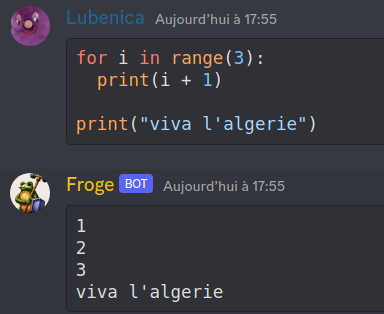

### Discord Code BOT

### Installation
```bash
pip install discord-code-bot
```

### Usage

Create a bot with discord.py
attach the `CodeBot.on_message()` method to your bot's `on_message`

```python

from discord_code_bot import CodeBot, PYTHON  

python_bot = CodeBot(*PYTHON)

# https://discordpy.readthedocs.io/en/stable/api.html#messages
async def on_message( message):
    python_bot.on_message(message)
```



### Security concerns

The code the user send is executed in an isolated docker container.
There is no chance a malicious code will mess with your system

A timeout of 8 seconds has been set to prevent an unoptimized implementation 
of fibonacci or a while True from causing damage to the system

to change the timeout limit, provide a timeout= argument
```python
    CodeBot(*PYTHON, timeout=15)
```

### Notes:

works with RUBY, PYTHON, PHP: just import 
```python
from discord_code_bot import PYTHON, RUBY, PHP
```

note the unpacking * in `CodeBot(*PYTHON)`
